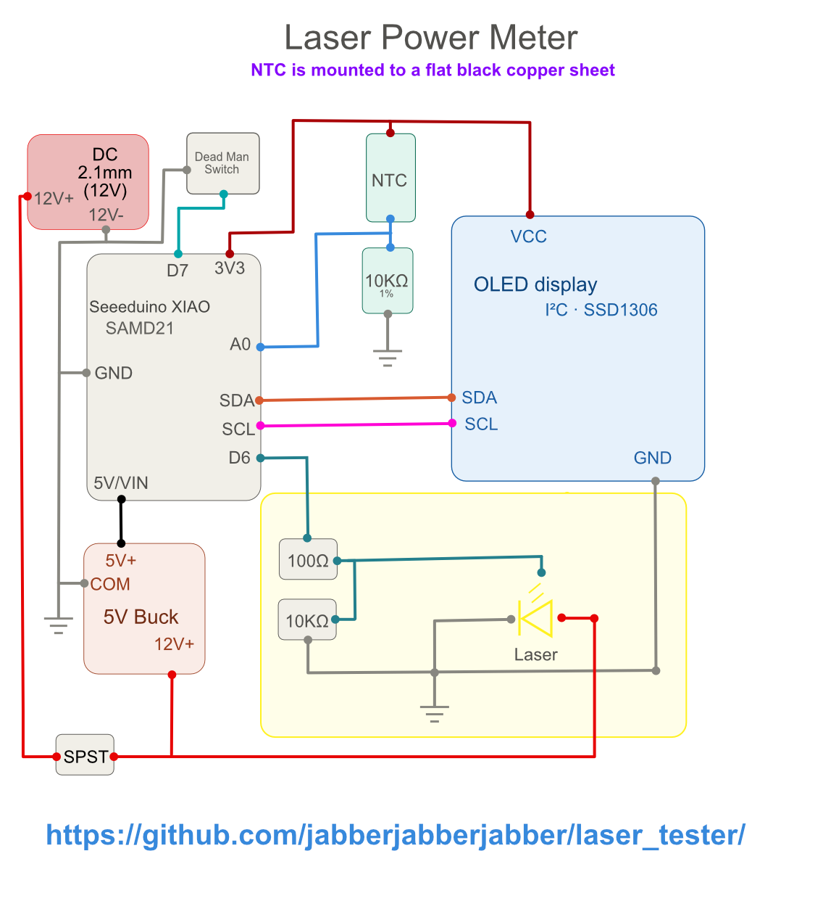

# Laser Power Tester

A low-cost laser power tester built around a Seeeduino XIAO SAMD21. It measures laser power by sensing how much a flat black copper slug heats up under the beam, using an NTC thermistor and displaying the result on a small OLED.



## How it works

The copper slug is coated black to maximise absorption. An NTC thermistor is bonded to the slug and sits in a resistor divider with a 10 kΩ 1% reference resistor. The SAMD21's 12-bit ADC reads the divider ratiometrically (no reference voltage error) and converts the reading to temperature via the standard beta equation. Temperature is displayed live on the OLED.

Power is derived from temperature (see [Calibration](#calibration)):

- `P = (T − T_ambient) / R_thermal`

D6 drives the laser module's TTL PWM input directly through a 100 Ω series resistor, with a 10 kΩ pull-down to GND to hold the input low during boot. `analogWrite` on D6 can step power levels for calibration curves.

## Parts

| Component | Value / Part |
|---|---|
| Microcontroller | Seeeduino XIAO SAMD21 |
| Temperature sensor | 10 kΩ NTC thermistor (β ≈ 3950) in a metal lug |
| Reference resistor | 10 kΩ 1% metal-film |
| Absorber | Flat black-coated copper slug |
| Display | SSD1306 128×64 I²C OLED |
| Laser | TTL PWM module (12 V, GND, PWM pins) |
| Laser wiring | 100 Ω series resistor (D7 → PWM in), 10 kΩ pull-down (PWM in → GND) |
| Power | 12 V DC (2.1 mm barrel), 5 V buck converter |
| Momentary switch | Dead man's switch, must hold it for laser to fire |

## Wiring

| XIAO pin | Connects to |
|---|---|
| 3V3 | Top of NTC divider (NTC → A0 → 10 kΩ → GND) |
| A0 | NTC / 10 kΩ junction |
| SDA | OLED SDA |
| SCL | OLED SCL |
| D6 | 100 Ω → laser PWM input (10 kΩ pull-down on PWM in to GND) |
| D7 | Momentary switch -> GND | 
| 5V/VIN | 5 V buck output |
| GND | Common ground |

12 V feeds both the buck converter and the laser module. An SPST switch on the 12 V line acts as a master power cut-off.
D7 connects through a momentary switch to ground. The switch must be held down for the laser to fire. If the switch is released the laser will cease to fire.

## Assembly

1. Make a copper slug. You can use a 1/2" copper pipe coupling. Cut it in half lengthwise and bend it until it becomes a rectangle. Pound it flat with a hammer, then sand it and wash it with dish detergent and rinse thoroughly, then rinse again with acetone and let dry
2. Paint the slug with the blackest flat paint you can get. *Maxx Darth Black*, *Musou*, *Absolute Black* are all extremely light absorbtive, but a little pricey. Three or four very thin coats should do fine
3. Use thermal tape to stick the NTC on the back of the slug, leaving room for the calibration resistor
4. Construct the PCB however you like

## Flashing

Requires [arduino-cli](https://arduino.github.io/arduino-cli/) with the Seeeduino SAMD core and Adafruit libraries installed.

```bash
# Install core (once)
arduino-cli core install Seeeduino:samd

# Install libraries (once)
arduino-cli lib install "Adafruit GFX Library" "Adafruit SSD1306"

# Compile and upload (adjust port as needed)
arduino-cli compile --fqbn Seeeduino:samd:seeed_XIAO_m0 .
arduino-cli upload  --fqbn Seeeduino:samd:seeed_XIAO_m0 --port COM7 .
```

## Calibration

See [calibration_guide.md](calibration_guide.md) for the full procedure. The short version:

1. Bond a 5 W+ power resistor to the slug with thermal tape
2. Apply a known voltage, wait for the temperature to plateau, and measure the actual current
3. Compute `R_thermal = (T_steady − T_ambient) / P_actual` in °C/W
4. Repeat at two or three power levels to check linearity
5. Add the constant to `laser_tester.ino` and uncomment the power display block:

```cpp
const float R_THERMAL = 8.7;   // your measured value, C/W
float power_W = (c - t_ambient) / R_THERMAL;
```
